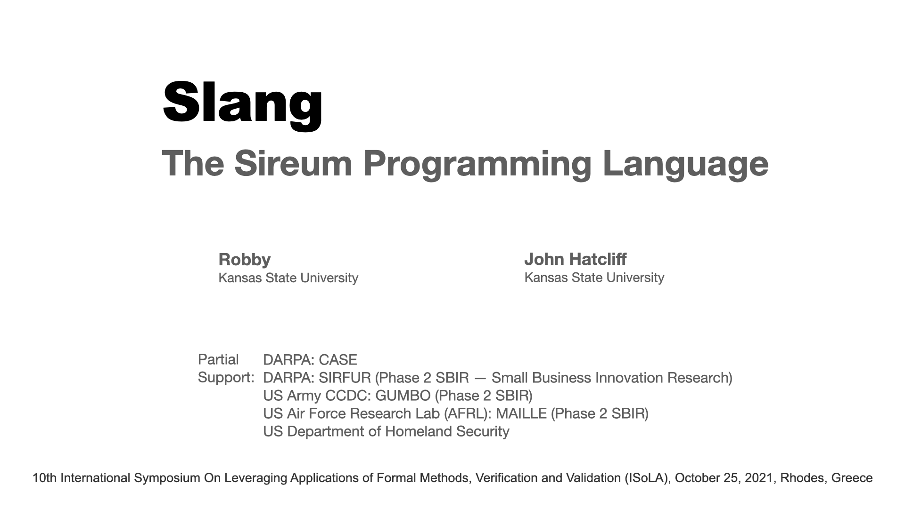
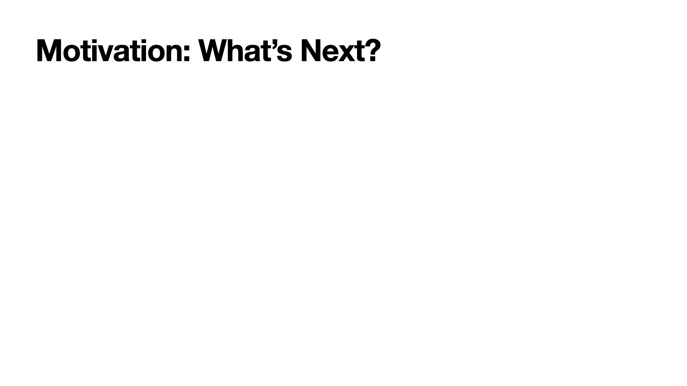
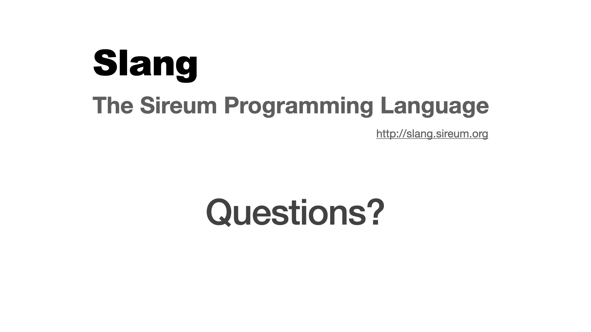

# Title 

`delay = 0`

* [2000]
  Hello! Today I am going to present Slang, the $sireumW$ Programming Language.

* Let me first give the motivation for our work.

# Motivation 

`delay = -2000`

* Recent years have seen significant advancements on formal methods.

# IVE Demo

`delay = 0, volume = 1.0, rate = 1.0, start = 0.0, end = 0.0`

# sha3 demo

`delay = 0, volume = 1.0, rate = 1.0, start = 0, end = 1000.0`

* For this demonstration, I will use a sha three crypto algorithm implementation in Slang.

# sha3 demo

`delay = 0, volume = 1.0, rate = 1.0, start = 4000.0, end = 10000.0, useVideoDuration = T`

* The implementation was hand-translated from a C code that is available online.

# Questions?

`delay = 0`

* Thank you all for attending! We now can take any questions that you might have.

* [-1000]
  [1.0; $claps$]