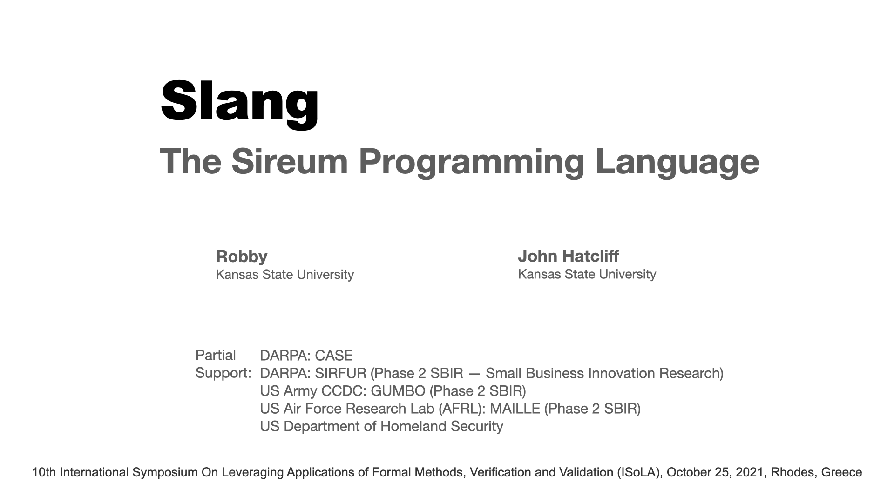
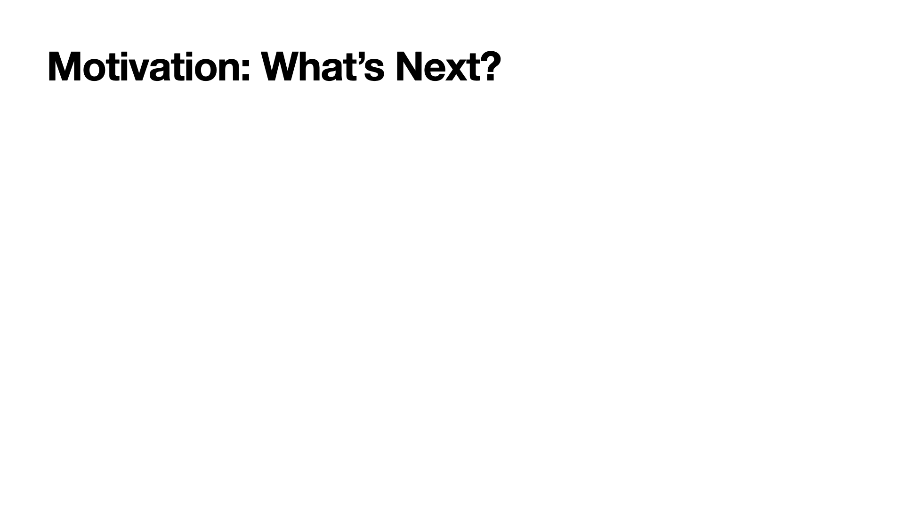
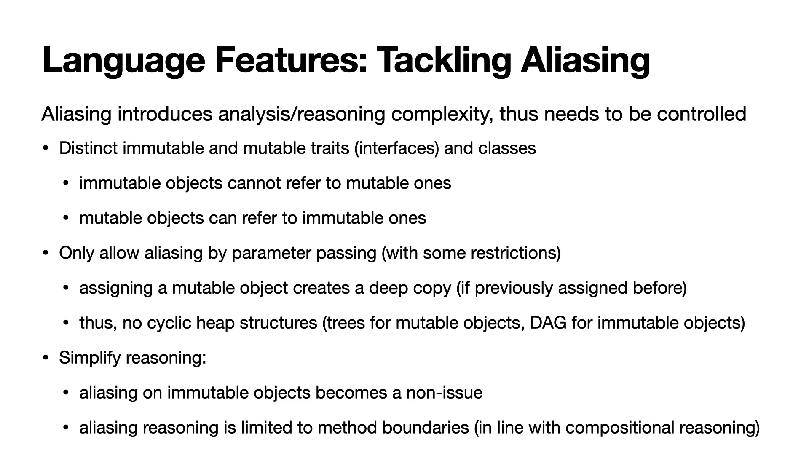
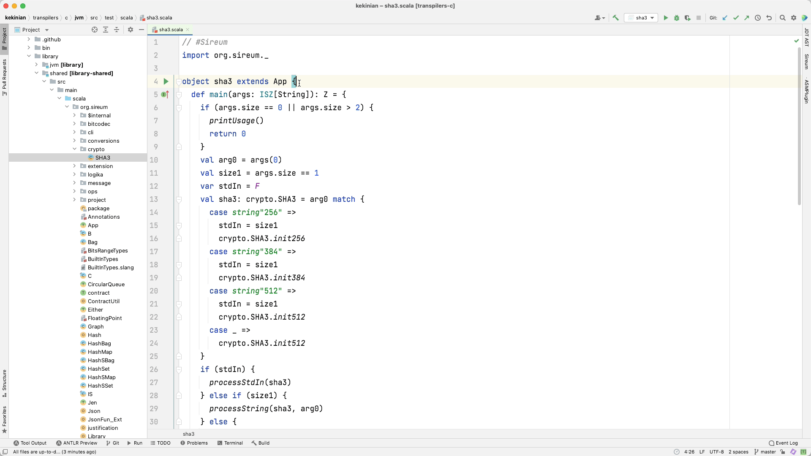
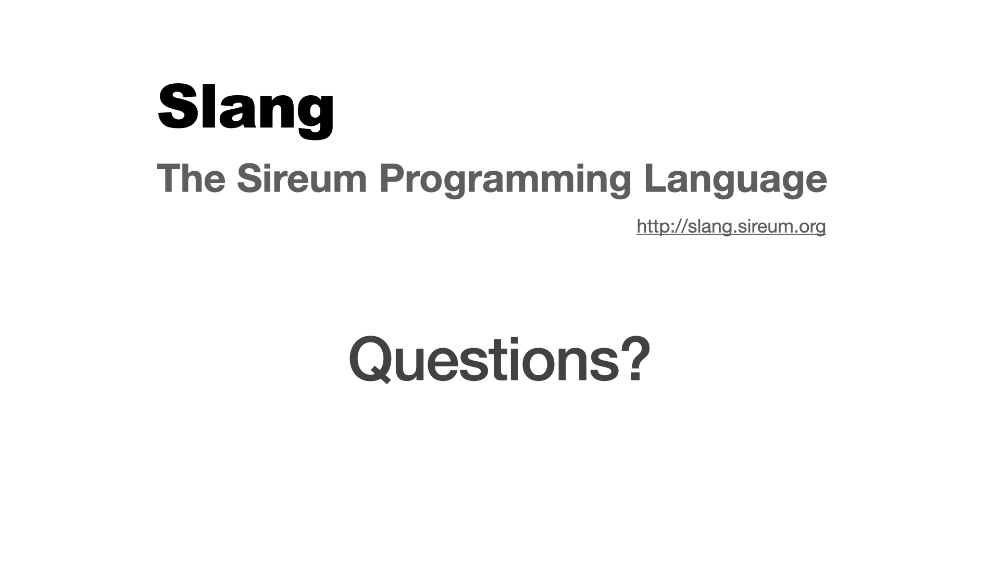

* Hello! Today I am going to present Slang, the Sireum Programming Language.

* Let me first give the motivation for our work.

----

* Recent years have seen significant advancements on formal methods.

----

----

* For this demonstration, I will use a sha three crypto algorithm implementation in Slang.

----

* The implementation was hand-translated from a C code that is available online.

----

* Thank you all for attending! We now can take any questions that you might have.